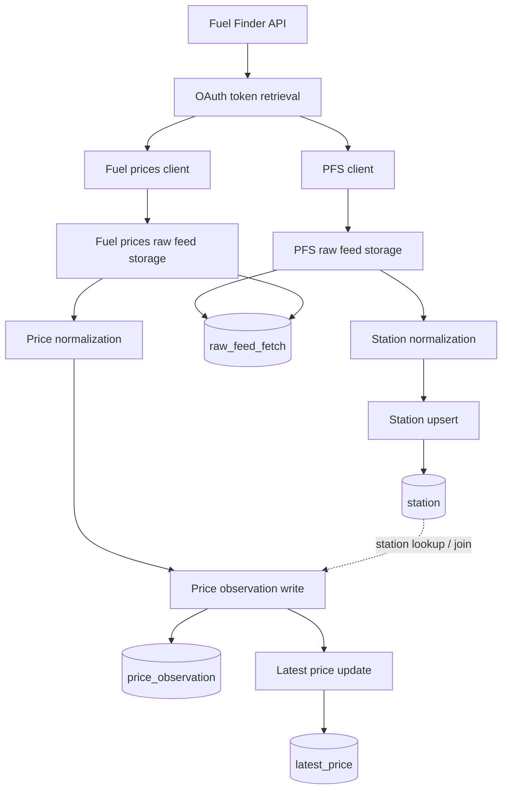

# Fuel Finder

Fuel Finder is a backend Java/Spring Boot project for ingesting and storing data from the UK Fuel Finder Scheme.

The repository currently focuses on the ingestion side of the platform: OAuth authentication, paginated feed retrieval, raw payload storage, station normalization, and PostgreSQL/PostGIS persistence. It is not yet a complete public API service.

## Current Status

What is implemented today:

- Spring Boot backend with Java 21
- PostgreSQL + PostGIS local environment via Docker Compose
- Flyway database migrations
- OAuth2 client credentials integration with the Fuel Finder API
- Paginated retrieval of PFS and fuel price feeds
- Raw feed persistence for auditability
- Station normalization and upsert flow
- Initial persistence model and schema for retailers, raw feeds, stations, price observations, and latest prices

What is still in progress:

- Full price normalization and write pipeline alignment
- Read model completion for latest prices
- REST API endpoints for nearby stations and price history
- Stronger automated integration coverage

## Tech Stack

- Java 21
- Spring Boot 3
- Spring Web
- Spring WebFlux `WebClient`
- Spring Data JPA
- Hibernate Spatial
- PostgreSQL
- PostGIS
- Flyway
- Docker Compose
- Lombok
- Testcontainers

## Architecture

The codebase is structured as a modular monolith with a backend-first focus.

Main areas:

- `config/`: Spring configuration and WebClient setup
- `ingestion/raw/auth/`: Fuel Finder API properties, OAuth clients, token management
- `ingestion/raw/client/`: external feed clients and DTOs
- `ingestion/raw/orchestrator/`: ingestion coordination
- `ingestion/raw/writer/`: raw payload storage and JDBC-based writes
- `ingestion/normalize/`: station normalization and upsert logic
- `persistence/entity/`: JPA entities
- `persistence/repository/`: Spring Data repositories

Structural diagram: [docs/structure-diagram.md](docs/structure-diagram.md)

### High-Level Flow



## Data Model

Core tables currently defined through Flyway:

- `retailer`: feed source registry
- `raw_feed_fetch`: raw JSON payloads and audit trail
- `station`: normalized station data with geo location
- `price_observation`: append-only price history
- `latest_price`: read model for current price lookups

Important design choices:

- raw external payloads are stored for traceability
- spatial data uses PostGIS
- database migrations are source-controlled with Flyway
- the model separates historical observations from the latest-price read model

## Running Locally

### 1. Create local environment variables

Create a local `.env` file from [`.env.example`](.env.example).

Example:

```bash
cp .env.example .env
```

On Windows, create `.env` manually if needed.

### 2. Start PostgreSQL/PostGIS

```bash
docker compose up -d
```

The Docker setup reads database values from `.env`.

### 3. Provide Fuel Finder credentials

The local profile expects:

```bash
FUEL_FINDER_CLIENT_ID=your_client_id
FUEL_FINDER_CLIENT_SECRET=your_client_secret
```

These are referenced by [`backend/src/main/resources/application-local.yml`](backend/src/main/resources/application-local.yml).

### 4. Run the backend

From [`backend/`](backend):

```bash
./gradlew bootRun --args='--spring.profiles.active=local'
```

On Windows PowerShell:

```powershell
.\gradlew.bat bootRun --args="--spring.profiles.active=local"
```

### 5. Verify the service

Health endpoint:

```text
http://localhost:8080/actuator/health
```

## Configuration Notes

- Base application settings live in [`backend/src/main/resources/application.yaml`](backend/src/main/resources/application.yaml)
- Local Fuel Finder credentials are loaded from [`backend/src/main/resources/application-local.yml`](backend/src/main/resources/application-local.yml)
- Production-specific API settings live in [`backend/src/main/resources/application-prod.yml`](backend/src/main/resources/application-prod.yml)
- `.env` is local-only and should never be committed

## Repository Layout

```text
fuel-finder/
|-- backend/
|   |-- build.gradle
|   |-- gradlew
|   |-- gradlew.bat
|   `-- src/
|       |-- main/
|       |   |-- java/uk/co/fuelfinder/
|       |   `-- resources/
|       `-- test/
|-- docs/
|-- docker/
|-- .env.example
|-- docker-compose.yml
`-- README.md
```

## Roadmap

Near-term priorities:

- complete the price ingestion pipeline
- align JDBC writes and schema evolution
- add integration tests for the ingestion flow
- expose geospatial and station-history API endpoints

## Why This Project

This project is meant to demonstrate practical backend engineering concerns such as:

- external API integration
- OAuth token management
- ingestion pipeline design
- auditability of imported data
- Postgres/PostGIS data modeling
- migration-driven schema management

## What This Repository Demonstrates

- integration with an OAuth2-protected external API
- paginated ingestion and raw payload retention
- normalization into a relational/geospatial model
- separation between ingestion, persistence, and future read APIs
- backend-first project structure designed for incremental evolution

## License

This project is licensed under the MIT License. See `LICENSE` for details.
