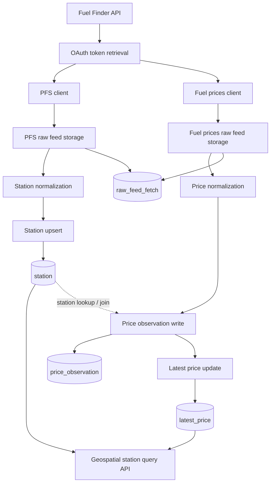

# Fuel Finder

Fuel Finder is a backend Java/Spring Boot project for ingesting and storing data from the UK Fuel Finder Scheme.

The repository now covers both the ingestion pipeline and an initial geospatial read API: OAuth authentication, paginated feed retrieval, raw payload storage, station normalization, PostgreSQL/PostGIS persistence, and public station lookup endpoints.

## Current Status

What is implemented today:

- Spring Boot backend with Java 21
- PostgreSQL + PostGIS local environment via Docker Compose
- Flyway database migrations
- OAuth2 client credentials integration with the Fuel Finder API
- Paginated retrieval of PFS and fuel price feeds
- Raw feed persistence for auditability
- Station normalization and upsert flow
- Fuel price normalization, deduplicated observation ingestion, and latest price projection/backfill
- Geospatial read APIs for nearby stations and cheapest nearby stations
- Local Caffeine caching for repeated geospatial read queries with transaction-safe invalidation after latest-price updates
- Global API error handling for invalid query parameters
- Lightweight operational logging for public station queries with success timing/result counts and consistent `400` warnings
- Station persistence enriched with `address`, `city`, `county`, `country`, and `postcode`
- Persistence model and schema for retailers, raw feeds, stations, price observations, and latest prices
- Unit tests with JUnit 5 and Mockito across auth, client, normalization, exception, and ingestion orchestration components
- Integration tests with Spring Boot Test and Testcontainers for JDBC persistence, end-to-end ingestion, deduplication, and station persistence flows

What is still in progress:

- Station price history and richer read APIs
- Broader integration coverage across more failure scenarios and ingestion edge cases
- Cleanup or consolidation of alternative JDBC write paths that are not part of the active ingestion flow

## Tech Stack

- Java 21
- Spring Boot 3
- Spring Web
- Spring WebFlux `WebClient`
- Spring Data JPA
- Spring Cache
- Hibernate Spatial
- PostgreSQL
- PostGIS
- Flyway
- Caffeine
- Docker Compose
- Lombok
- Testcontainers

## Architecture

The codebase is structured as a modular monolith with a backend-first focus.

Main areas:

- `config/`: Spring configuration, WebClient setup, and cache configuration/properties
- `ingestion/raw/auth/`: Fuel Finder API properties, OAuth clients, token management
- `ingestion/raw/client/`: external feed clients and DTOs
- `ingestion/raw/orchestrator/`: ingestion coordination
- `ingestion/raw/writer/`: raw payload storage plus experimental/alternative JDBC write helpers
- `ingestion/normalize/`: station normalization, price normalization, observation ingestion, and latest price projection
- `api/station/`: station read endpoints for nearby and cheapest-nearby lookups
- `persistence/entity/`: JPA entities
- `persistence/repository/`: Spring Data repositories

### High-Level Flow



## Data Model

Core tables currently defined through Flyway:

- `retailer`: feed source registry
- `raw_feed_fetch`: raw JSON payloads and audit trail
- `station`: normalized station data with geo location and location metadata
- `price_observation`: append-only price history
- `latest_price`: read model for current price lookups
- `shedlock`: distributed scheduler lock table

Important design choices:

- raw external payloads are stored for traceability
- spatial data uses PostGIS
- database migrations are source-controlled with Flyway
- the model separates historical observations from the latest-price read model
- geospatial API reads are served from `station` joined to `latest_price`
- repeated geospatial reads are cached in-memory to reduce repeated DB load

### Station Location Fields

The `station` model now persists:

- `address` from PFS `address_line_1`
- `city`
- `county`
- `country`
- `postcode`
- `location` as a PostGIS geography point

This keeps the primary street address simple while preserving the other location fields separately for future query and presentation needs.

## API Endpoints

Currently available read endpoints:

- `GET /v1/stations/nearby`
- `GET /v1/stations/cheapest-nearby`

Both endpoints accept:

- `lat`
- `lon`
- `radiusMeters`
- `fuelType`
- `limit` optional, default `10`, max `100`

Example:

```text
http://localhost:8080/v1/stations/nearby?lat=51.5074&lon=-0.1278&radiusMeters=5000&fuelType=E5&limit=10
```

```text
http://localhost:8080/v1/stations/cheapest-nearby?lat=51.5074&lon=-0.1278&radiusMeters=5000&fuelType=E5&limit=10
```

Behavior:

- `/nearby` sorts primarily by distance, then price
- `/cheapest-nearby` sorts primarily by price, then distance
- valid queries with no matches return `200 OK` with `[]`
- both endpoints are cached in-memory for repeated equivalent queries
- cache keys are based on normalized query input: trimmed/uppercased `fuelType` and resolved default `limit`
- caches are invalidated after transaction commit when the `latest_price` read model changes
- invalid, missing, or non-parseable parameters return HTTP `400` via a global API exception handler
- successful requests emit a single structured `info` log with path, query parameters, status, duration, and result count
- invalid requests emit a single structured `warn` log with the same request context plus a synthesized validation error message

### OpenAPI / Swagger

The backend now exposes machine-readable OpenAPI docs plus Swagger UI:

- OpenAPI JSON: `http://localhost:8080/v3/api-docs`
- Swagger UI: `http://localhost:8080/swagger-ui.html`

Swagger UI documents query parameters, response payloads, and standard `400` validation-style errors for the public station endpoints.

## Running Locally

### 1. Create local environment variables

Create a local `.env` file from [`.env.example`](.env.example).

Example:

```bash
cp .env.example .env
```

On Windows, create `.env` manually if needed.

### 2. Start PostgreSQL/PostGIS

```bash
docker compose up -d
```

The Docker setup reads database values from `.env`.

### 3. Provide Fuel Finder credentials

The local profile expects:

```bash
FUEL_FINDER_CLIENT_ID=your_client_id
FUEL_FINDER_CLIENT_SECRET=your_client_secret
```

These are referenced by [`backend/src/main/resources/application-local.yml`](backend/src/main/resources/application-local.yml).

### 4. Run the backend

From [`backend/`](backend):

```bash
./gradlew bootRun --args='--spring.profiles.active=local'
```

On Windows PowerShell:

```powershell
.\gradlew.bat bootRun --args="--spring.profiles.active=local"
```

### 5. Optional: run one-shot manual ingestion

If you want to trigger ingestion once on startup instead of using the scheduler:

```powershell
.\gradlew.bat bootRun --args="--spring.profiles.active=local-manual"
```

### 6. Verify the service

Health endpoint:

```text
http://localhost:8080/actuator/health
```

Nearby stations:

```text
http://localhost:8080/v1/stations/nearby?lat=51.5074&lon=-0.1278&radiusMeters=5000&fuelType=E5&limit=10
```

Cheapest nearby stations:

```text
http://localhost:8080/v1/stations/cheapest-nearby?lat=51.5074&lon=-0.1278&radiusMeters=5000&fuelType=E5&limit=10
```

## Configuration Notes

- Base application settings live in [`backend/src/main/resources/application.yaml`](backend/src/main/resources/application.yaml)
- Local Fuel Finder credentials are loaded from [`backend/src/main/resources/application-local.yml`](backend/src/main/resources/application-local.yml)
- Manual local ingestion settings live in [`backend/src/main/resources/application-local-manual.yml`](backend/src/main/resources/application-local-manual.yml)
- Production-specific API settings live in [`backend/src/main/resources/application-prod.yml`](backend/src/main/resources/application-prod.yml)
- Lightweight test-profile settings live in [`backend/src/test/resources/application-test.yaml`](backend/src/test/resources/application-test.yaml)
- `.env` is local-only and should never be committed

### Cache Settings

The station read API uses local in-memory caches backed by Caffeine.

Current defaults in [`backend/src/main/resources/application.yaml`](backend/src/main/resources/application.yaml):

- `fuelfinder.cache.nearby.ttl=60s`
- `fuelfinder.cache.nearby.max-size=500`
- `fuelfinder.cache.cheapest-nearby.ttl=60s`
- `fuelfinder.cache.cheapest-nearby.max-size=500`

Notes:

- the cache is local to each application instance
- cache entries are evicted automatically after `60s`
- both station-query caches are cleared after a successful transaction commit that changes the `latest_price` read model
- equivalent requests such as `fuelType=e5` and `fuelType=E5` reuse the same cache entry after normalization

## Testing

The backend includes unit and integration tests based on JUnit 5, Mockito, Spring Boot Test, Testcontainers, and JaCoCo coverage reporting.

Current test coverage includes:

- unit tests for OAuth token retrieval and Fuel Finder API clients
- unit tests for ingestion orchestration, station normalization, latest-price projection, price observation ingestion, utility logic, station query services, and custom exceptions
- cache-focused tests for normalized query keys, repeated-query cache hits, and after-commit cache invalidation behavior
- integration tests for JDBC repository writes against PostgreSQL/PostGIS
- integration tests for end-to-end ingestion, repeated-ingestion deduplication flows, and station field persistence

Run the full backend test suite from [`backend/`](backend):

```bash
./gradlew test
```

On Windows PowerShell:

```powershell
.\gradlew.bat test
```

Generate the JaCoCo HTML coverage report:

```bash
./gradlew test jacocoTestReport
```

On Windows PowerShell:

```powershell
.\gradlew.bat test jacocoTestReport
```

The HTML report is written to [`backend/build/reports/jacoco/test/html/index.html`](backend/build/reports/jacoco/test/html/index.html).

Run only selected unit tests:

```bash
./gradlew test --tests "uk.co.fuelfinder.api.station.StationQueryServiceTest" --tests "uk.co.fuelfinder.api.station.CachedStationQueryServiceCachingTest"
```

Run only selected integration tests:

```bash
./gradlew test --tests "uk.co.fuelfinder.ingestion.raw.writer.JdbcRepositoriesIT" --tests "uk.co.fuelfinder.ingestion.raw.orchestrator.RetailerIngestionServiceIT" --tests "uk.co.fuelfinder.ingestion.raw.orchestrator.IngestionDedupeIT"
```

Tests matching `*IT` run as part of the standard `test` task in this project. Integration tests require Docker because Testcontainers starts PostgreSQL/PostGIS containers automatically.

## Repository Layout

```text
fuel-finder/
|-- backend/
|   |-- build.gradle
|   |-- gradlew
|   |-- gradlew.bat
|   `-- src/
|       |-- main/
|       |   |-- java/uk/co/fuelfinder/
|       |   `-- resources/
|       `-- test/
|-- docs/
|-- docker/
|-- .env.example
|-- docker-compose.yml
`-- README.md
```

## Roadmap

Near-term priorities:

- extend read APIs with station price history and richer filters
- extend integration tests to cover more ingestion edge cases and failure paths
- raise and enforce JaCoCo coverage thresholds over time
- align or remove unused JDBC write paths
- deepen observability beyond the current API request logging and ingestion diagnostics

## Why This Project

This project is meant to demonstrate practical backend engineering concerns such as:

- external API integration
- OAuth token management
- ingestion pipeline design
- auditability of imported data
- Postgres/PostGIS data modeling
- migration-driven schema management
- geospatial read API design on top of ingestion-driven read models

## What This Repository Demonstrates

- integration with an OAuth2-protected external API
- paginated ingestion and raw payload retention
- normalization into a relational/geospatial model
- separation between ingestion, persistence, and read APIs
- backend-first project structure designed for incremental evolution

## License

This project is licensed under the Proprietary License (All Rights Reserved). See `LICENSE` for details.
