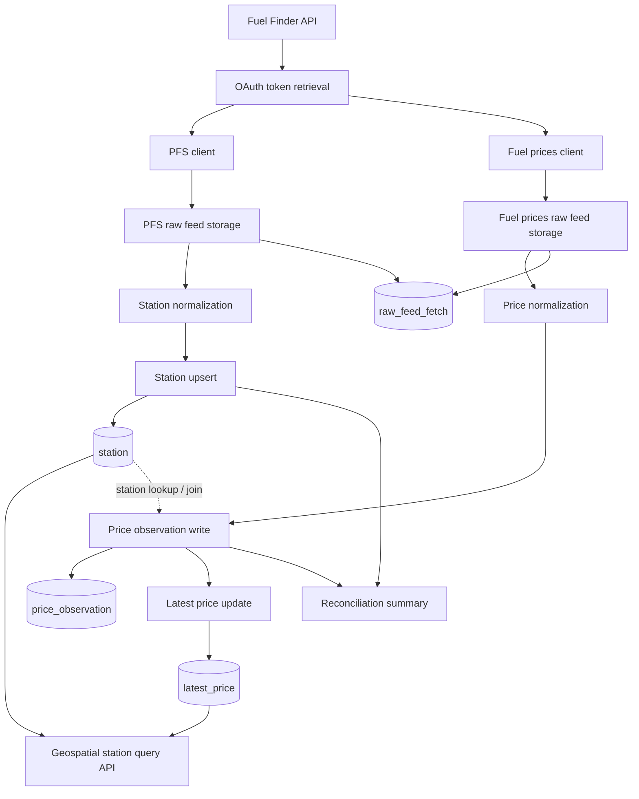

# Fuel Finder

Fuel Finder is a backend Java/Spring Boot project for ingesting and storing data from the UK Fuel Finder Scheme.

The repository now covers both the ingestion pipeline and an initial geospatial read API: OAuth authentication, paginated feed retrieval, raw payload storage, station normalization, PostgreSQL/PostGIS persistence, and public station lookup endpoints.

## Current Status

What is implemented today:

- Spring Boot backend with Java 21
- PostgreSQL + PostGIS local environment via Docker Compose
- Optional Prometheus and Grafana local observability stack
- Backend Docker image build
- GitHub Actions CI for tests, coverage verification, JAR build, and Docker build
- Flyway database migrations
- OAuth2 client credentials integration with the Fuel Finder API
- Paginated retrieval of PFS and fuel price feeds
- Raw feed persistence for auditability
- Station normalization and upsert flow
- Ingestion reconciliation checks for raw, normalized, skipped, duplicate, and persisted counts
- Fuel price normalization, deduplicated observation ingestion, and latest price projection/backfill
- Geospatial read APIs for nearby stations, cheapest nearby stations, map bounds, station details, and price history
- Local Caffeine caching for repeated geospatial read queries with transaction-safe invalidation after latest-price updates
- Global API error handling for invalid query parameters
- Lightweight operational logging for public station queries with success timing/result counts and consistent `400` warnings
- Station persistence enriched with `address`, `city`, `county`, `country`, and `postcode`
- Persistence model and schema for retailers, raw feeds, stations, price observations, and latest prices
- Unit tests with JUnit 5 and Mockito across auth, client, normalization, exception, and ingestion orchestration components
- Integration tests with Spring Boot Test and Testcontainers for repository persistence, end-to-end ingestion, deduplication, cache invalidation, and station read flows

What is still in progress:

- Additional read filters and query shapes beyond the current station endpoints
- Broader integration coverage across more failure scenarios and ingestion edge cases

## Tech Stack

- Java 21
- Spring Boot 3
- Spring Web
- Spring WebFlux `WebClient`
- Spring Data JPA
- Spring Cache
- Hibernate Spatial
- PostgreSQL
- PostGIS
- Flyway
- Caffeine
- Docker
- GitHub Actions
- Lombok
- JUnit 5
- Mockito
- Testcontainers
- JaCoCo

## Architecture

The codebase is structured as a modular monolith with a backend-first focus.

Main areas:

- `config/`: Spring configuration, WebClient setup, and cache configuration/properties
- `ingestion/raw/auth/`: Fuel Finder API properties, OAuth clients, token management
- `ingestion/raw/client/`: external feed clients and DTOs
- `ingestion/raw/orchestrator/`: ingestion coordination
- `ingestion/raw/writer/`: raw payload storage
- `ingestion/normalize/`: station normalization, price normalization, observation ingestion, and latest price projection
- `api/station/`: station read endpoints for nearby, cheapest-nearby, map bounds, details, and price history lookups
- `persistence/entity/`: JPA entities
- `persistence/repository/`: Spring Data repositories

### High-Level Flow


```mermaid
flowchart TD
    A[Fuel Finder API] --> B[OAuth token retrieval]
    B --> C[PFS client]
    B --> D[Fuel prices client]

    C --> E[PFS raw feed storage]
    E --> F[Station normalization]
    F --> G[Station upsert]
    G --> H[(station)]
    E --> I[(raw_feed_fetch)]

    D --> J[Fuel prices raw feed storage]
    J --> K[Price normalization]
    K --> L[Price observation write]
    L --> M[(price_observation)]
    L --> N[Latest price update]
    N --> O[(latest_price)]
    H --> P[Geospatial station query API]
    O --> P
    H -. station lookup / join .-> L
    J --> I
    G --> Q[Reconciliation summary]
    L --> Q
```

### Fuel Finder HTTP resilience

The authenticated Fuel Finder clients share one bounded Reactor Netty connection pool and use explicit connection and response timeouts. Transient connection failures, timeouts, HTTP 408/429, and selected 5xx responses are retried up to two times with exponential backoff and jitter. Valid `Retry-After` values on 429 and 503 responses are honored as minimum delays up to a separate 30-second operational limit.

The current values are initial operational defaults and are externally configurable under `fuelfinder.api.http`. With three attempts, a 20-second response timeout, and two permitted 30-second `Retry-After` delays, one logical request can approach roughly two minutes. This budget, along with pool sizing and retry limits, should be revisited using ingestion-duration metrics and representative load testing.

## Data Model

Core tables currently defined through Flyway:

- `retailer`: feed source registry
- `raw_feed_fetch`: raw JSON payloads and audit trail
- `station`: normalized station data with geo location and location metadata
- `price_observation`: append-only price history
- `latest_price`: read model for current price lookups
- `shedlock`: distributed scheduler lock table

Important design choices:

- raw external payloads are stored for traceability
- ingestion records reconciliation counts after raw payload parsing, normalization, skips, duplicate detection, and persistence outcomes
- spatial data uses PostGIS
- database migrations are source-controlled with Flyway
- the model separates historical observations from the latest-price read model
- geospatial API reads are served from `station` joined to `latest_price`
- repeated geospatial reads are cached in-memory to reduce repeated DB load

### Station Location Fields

The `station` model now persists:

- `address` from PFS `address_line_1`
- `city`
- `county`
- `country`
- `postcode`
- `location` as a PostGIS geography point

This keeps the primary street address simple while preserving the other location fields separately for future query and presentation needs.

## Ingestion Reconciliation

The ingestion orchestrator logs a reconciliation summary after each retailer batch has been parsed and processed.

Reconciliation has a factual status and a separate runtime action:

- `OK`: raw records reconcile with normalized and persisted outcomes, with no accounted skips
- `OK_WITH_SKIPS`: counts reconcile, but known skips or duplicates were recorded
- `FAILED`: at least one reconciliation formula has an unexplained mismatch

The runtime action controls what happens when status is `FAILED`:

- `FAIL`: aborts the retailer ingestion and returns a failed ingestion summary
- `WARN`: logs the failed reconciliation but lets the ingestion business outcome remain successful

Important distinction: in warn mode, the reconciliation status still remains `FAILED`; only the reaction policy changes.

### Count Levels

PFS station reconciliation is station-level:

```text
rawStationCount == normalizedStationCount + skippedCount
```

`skippedCount` is the aggregate used by the formula. The first specific skip reason tracked today is `skippedMissingSiteIdCount`.

Fuel price reconciliation is split into two separate levels:

```text
rawFuelPriceEntryCount == normalizedObservationCount + skippedInvalidUnusableEntryCount
```

```text
normalizedObservationCount == insertedCount + duplicateCount + missingStationCount + otherPersistenceSkipCount
```

This keeps raw-payload normalization accounting separate from persistence/business outcomes such as duplicates and missing stations.

### Reconciliation Logs

The structured reconciliation log includes:

- retailer
- raw feed fetch IDs
- PFS raw, normalized, skipped, and upsert counts
- fuel price raw entry, normalized observation, invalid/unusable skip, inserted, duplicate, missing-station, and other persistence-skip counts
- reconciliation status, configured action, abort decision, and message

## API Endpoints

Currently available read endpoints:

- `GET /v1/stations/nearby`
- `GET /v1/stations/cheapest-nearby`
- `GET /v1/stations/in-bounds`
- `GET /v1/stations/{stationId}`
- `GET /v1/stations/{stationId}/price-history`
- `GET /v1/stations/{stationId}/price-history/summary`

Nearby and cheapest-nearby endpoints accept:

- `lat`
- `lon`
- `radiusMeters`
- `fuelType`
- `limit` optional, default `10`, max `100`

In-bounds endpoint accepts:

- `bbox` required, formatted as `west,south,east,north`
- `fuelType`
- `limit` optional, default `250`, max `500`

Station details endpoint accepts:

- `stationId` path variable as UUID

Station price history endpoint accepts:

- `stationId` path variable as UUID
- `fuelType` required
- `from` optional ISO-8601 timestamp
- `to` optional ISO-8601 timestamp
- `limit` optional, default `100`, max `1000`

Station price history summary endpoint accepts:

- `stationId` path variable as UUID
- `fuelType` required
- `from` optional ISO-8601 timestamp
- `to` optional ISO-8601 timestamp
- `limit` optional, default `30`, max `365`

Example:

```text
http://localhost:8080/v1/stations/nearby?lat=51.5074&lon=-0.1278&radiusMeters=5000&fuelType=E5&limit=10
```

```text
http://localhost:8080/v1/stations/cheapest-nearby?lat=51.5074&lon=-0.1278&radiusMeters=5000&fuelType=E5&limit=10
```

```text
http://localhost:8080/v1/stations/in-bounds?bbox=-0.20,51.45,-0.05,51.55&fuelType=E5&limit=250
```

```text
http://localhost:8080/v1/stations/123e4567-e89b-12d3-a456-426614174000
```

```text
http://localhost:8080/v1/stations/123e4567-e89b-12d3-a456-426614174000/price-history?fuelType=E5&from=2026-04-18T00:00:00Z&to=2026-04-19T00:00:00Z&limit=100
```

```text
http://localhost:8080/v1/stations/123e4567-e89b-12d3-a456-426614174000/price-history/summary?fuelType=E5&from=2026-04-01T00:00:00Z&to=2026-04-30T23:59:59Z&limit=30
```

Behavior:

- `/nearby` sorts primarily by distance, then price
- `/cheapest-nearby` sorts primarily by price, then distance
- `/in-bounds` returns active station map markers inside the requested bounding box
- `/v1/stations/{stationId}` returns a single station with full address, coordinates, and all latest prices by fuel type
- `/v1/stations/{stationId}/price-history` returns historical observations from `price_observation` for one required `fuelType`
- `/v1/stations/{stationId}/price-history/summary` returns daily UTC summary buckets for one required `fuelType`
- valid queries with no matches return `200 OK` with `[]`
- a valid station detail lookup with no latest prices returns `200 OK` with `latestPrices: []`
- a valid price-history lookup with no matching observations returns `200 OK` with `observations: []`
- a valid price-history-summary lookup with no matching observations returns `200 OK` with `summaries: []`
- price history summary buckets include `bucketStart`, `bucketEnd`, `firstPricePence`, `highestPricePence`, `lowestPricePence`, `lastPricePence`, and `observationCount`
- summary buckets are grouped by calendar day in `UTC` and ordered newest bucket first
- station query endpoints are cached in-memory for repeated equivalent queries
- cache keys are based on normalized query input: trimmed/uppercased `fuelType` and resolved default `limit`
- caches are invalidated after transaction commit when the `latest_price` read model changes
- station price history and station price history summary each have their own cache and are invalidated after transaction commit when `price_observation` changes
- invalid, missing, or non-parseable parameters return HTTP `400` via a global API exception handler
- successful requests emit a single structured `info` log with path, query parameters, status, duration, and result count
- invalid requests emit a single structured `warn` log with the same request context plus a synthesized validation error message
- station detail requests for unknown UUIDs return `404 Not Found` with the standard API error payload
- station price history returns `404 Not Found` only when the station does not exist
- station price history summary returns `404 Not Found` only when the station does not exist

### OpenAPI / Swagger

The backend now exposes machine-readable OpenAPI docs plus Swagger UI:

- OpenAPI JSON: `http://localhost:8080/v3/api-docs`
- Swagger UI: `http://localhost:8080/swagger-ui.html`

Swagger UI documents query parameters, response payloads, and standard `400` validation-style errors for the public station endpoints.

## Running Locally

### 1. Create local environment variables

Create a local `.env` file from [`.env.example`](.env.example).

Example:

```bash
cp .env.example .env
```

On Windows, create `.env` manually if needed.

### 2. Start PostgreSQL/PostGIS

```bash
docker compose up -d
```

The Docker setup reads database values from `.env`.

### 3. Provide Fuel Finder credentials

The local profile expects:

```bash
FUEL_FINDER_CLIENT_ID=your_client_id
FUEL_FINDER_CLIENT_SECRET=your_client_secret
```

These are referenced by [`backend/src/main/resources/application-local.yml`](backend/src/main/resources/application-local.yml).

### 4. Run the backend

From [`backend/`](backend):

```bash
./gradlew bootRun --args='--spring.profiles.active=local'
```

On Windows PowerShell:

```powershell
.\gradlew.bat bootRun --args="--spring.profiles.active=local"
```

### 5. Optional: run one-shot manual ingestion

If you want to trigger ingestion once on startup instead of using the scheduler:

```powershell
.\gradlew.bat bootRun --args="--spring.profiles.active=local-manual"
```

### 6. Verify the service

Health endpoint:

```text
http://localhost:8080/actuator/health
```

Prometheus scrape endpoint:

```text
http://localhost:8080/actuator/prometheus
```

### 7. Optional: start Prometheus and Grafana

The default Compose workflow remains database-only. With the backend running on the host, start the optional observability services with:

```bash
docker compose --profile observability up -d
```

Local endpoints:

- Prometheus: `http://localhost:9090`
- Grafana: `http://localhost:3000`
- Grafana dashboard: **Fuel Finder / Fuel Finder Overview**

Grafana uses `admin` / `admin` for local development unless `GRAFANA_ADMIN_USER` and `GRAFANA_ADMIN_PASSWORD` are set. Prometheus scrapes the host-run backend at `host.docker.internal:8080`.

Nearby stations:

```text
http://localhost:8080/v1/stations/nearby?lat=51.5074&lon=-0.1278&radiusMeters=5000&fuelType=E5&limit=10
```

Cheapest nearby stations:

```text
http://localhost:8080/v1/stations/cheapest-nearby?lat=51.5074&lon=-0.1278&radiusMeters=5000&fuelType=E5&limit=10
```

Station details:

```text
http://localhost:8080/v1/stations/123e4567-e89b-12d3-a456-426614174000
```

Station price history summary:

```text
http://localhost:8080/v1/stations/123e4567-e89b-12d3-a456-426614174000/price-history/summary?fuelType=E5&from=2026-04-01T00:00:00Z&to=2026-04-30T23:59:59Z&limit=30
```

## Docker

Build the backend image from the repository root:

```bash
docker build -f backend/Dockerfile backend -t fuel-finder-backend:local
```

Or from [`backend/`](backend):

```bash
docker build -t fuel-finder-backend:local .
```

The Docker image does not hard-code a Spring profile. Production deployments should explicitly set `SPRING_PROFILES_ACTIVE=prod` at runtime and provide the required database and Fuel Finder API configuration through environment variables/secrets.

## Production Runtime Configuration

The Docker image is environment-agnostic: it does not set a Spring profile, so the same image can be promoted between environments. A production deployment must set `SPRING_PROFILES_ACTIVE=prod`. This is a deployment requirement rather than an `application-prod.yml` placeholder.

The `prod` profile requires the following runtime configuration. The placeholders have no usable defaults.

| Variable | Description |
|---|---|
| `FUEL_FINDER_CLIENT_ID` | OAuth2 client ID for the external Fuel Finder API. Must not be blank. |
| `FUEL_FINDER_CLIENT_SECRET` | OAuth2 client secret for the external Fuel Finder API. Must not be blank. |
| `SPRING_DATASOURCE_URL` | JDBC URL for the production PostgreSQL/PostGIS database. |
| `SPRING_DATASOURCE_USERNAME` | Production database username. |
| `SPRING_DATASOURCE_PASSWORD` | Production database password. |

Missing required placeholders prevent production configuration from being resolved. Missing or blank OAuth credentials also fail configuration binding through Bean Validation, before ingestion or an external API client can start. Database settings are supplied through Spring Boot's standard datasource environment variables; no custom `DB_*` aliases are used.

Secrets must be supplied by the deployment environment or its secret manager and must never be committed. Copy [`.env.prod.example`](.env.prod.example) to the ignored `.env.prod` file only for a local container exercise, then replace every placeholder:

```bash
cp .env.prod.example .env.prod
```

An equivalent container invocation is:

```bash
docker run --rm -p 8080:8080 \
  -e SPRING_PROFILES_ACTIVE=prod \
  -e FUEL_FINDER_CLIENT_ID='<client-id>' \
  -e FUEL_FINDER_CLIENT_SECRET='<client-secret>' \
  -e SPRING_DATASOURCE_URL='jdbc:postgresql://<database-host>:5432/<database-name>' \
  -e SPRING_DATASOURCE_USERNAME='<database-user>' \
  -e SPRING_DATASOURCE_PASSWORD='<database-password>' \
  fuel-finder-backend:local
```

### Effective production defaults

These values are explicitly defined by the current base and production YAML configuration:

| Setting | Effective value in `prod` |
|---|---|
| Server port | `8080` |
| Fuel Finder API base URL | `https://www.fuel-finder.service.gov.uk/api/v1` |
| OAuth token path | `/oauth/generate_access_token` |
| OAuth refresh path | `/oauth/regenerate_access_token` |
| Ingestion scheduler | Enabled, every 30 minutes |
| Ingestion retailer | `FUEL_FINDER_API` |
| Actuator web exposure | `health,info,prometheus` |
| Health details | `never` |
| OpenAPI API docs | Disabled |
| Swagger UI | Disabled |

There are currently no additional application-specific optional environment variables in the supported production contract.

## Configuration Notes

- Base application settings live in [`backend/src/main/resources/application.yaml`](backend/src/main/resources/application.yaml)
- Local Fuel Finder credentials are loaded from [`backend/src/main/resources/application-local.yml`](backend/src/main/resources/application-local.yml)
- Manual local ingestion settings live in [`backend/src/main/resources/application-local-manual.yml`](backend/src/main/resources/application-local-manual.yml)
- Production-specific API settings live in [`backend/src/main/resources/application-prod.yml`](backend/src/main/resources/application-prod.yml)
- Lightweight test-profile settings live in [`backend/src/test/resources/application-test.yaml`](backend/src/test/resources/application-test.yaml)
- `.env` is local-only and should never be committed

### Cache Settings

The station read API uses local in-memory caches backed by Caffeine.

Current defaults in [`backend/src/main/resources/application.yaml`](backend/src/main/resources/application.yaml):

- `fuelfinder.ingestion.reconciliation.unexplained-mismatch-action=fail`
- `fuelfinder.cache.nearby.ttl=60s`
- `fuelfinder.cache.nearby.max-size=500`
- `fuelfinder.cache.cheapest-nearby.ttl=60s`
- `fuelfinder.cache.cheapest-nearby.max-size=500`
- `fuelfinder.cache.in-bounds.ttl=60s`
- `fuelfinder.cache.in-bounds.max-size=500`
- `fuelfinder.cache.details.ttl=90s`
- `fuelfinder.cache.details.max-size=1000`
- `fuelfinder.cache.history.ttl=90s`
- `fuelfinder.cache.history.max-size=1000`
- `fuelfinder.cache.history-summary.ttl=90s`
- `fuelfinder.cache.history-summary.max-size=1000`

Notes:

- `fuelfinder.ingestion.reconciliation.unexplained-mismatch-action` accepts `fail` or `warn`; use `warn` only when you want ingestion to continue after an unexplained reconciliation mismatch while still reporting `FAILED`
- the cache is local to each application instance
- nearby, cheapest-nearby, and in-bounds cache entries are evicted automatically after `60s`
- station details, price history, and price history summary cache entries are evicted automatically after `90s`
- station detail responses are cached separately by `stationId`
- in-bounds responses are cached by normalized bounding box, normalized `fuelType`, and resolved `limit`
- station price history responses are cached by `stationId`, normalized `fuelType`, `from`, `to`, and resolved `limit`
- station price history summary responses are cached by `stationId`, normalized `fuelType`, `from`, `to`, and resolved `limit`
- detail-cache TTL should stay moderate because the payload includes latest prices as well as station metadata
- all station-query caches are cleared after a successful transaction commit that changes the `latest_price` read model
- history-cache entries are cleared after a successful transaction commit that changes `price_observation`
- the station-details cache is also cleared after a successful transaction commit that changes station metadata
- equivalent requests such as `fuelType=e5` and `fuelType=E5` reuse the same cache entry after normalization
- Caffeine statistics are enabled and exported through Spring Boot's built-in `cache.*` metrics

### Metrics and Local Observability

Adding the Prometheus Micrometer registry makes metrics available at:

```text
/actuator/prometheus
```

This endpoint must be reachable by Prometheus or equivalent monitoring infrastructure, but it must not be exposed as a public application endpoint. Restrict it through deployment networking, firewall rules, a private management route, or reverse-proxy access policy.

Fuel Finder custom meters use bounded tags only:

| Java meter | Type | Tags | Meaning |
|---|---|---|---|
| `fuelfinder.ingestion.duration` | Timer | `outcome=success\|failure` | Complete ingestion execution duration; the Timer count is also the run count |
| `fuelfinder.ingestion.reconciliation` | Counter | `status=ok\|ok_with_skips\|failed` | Reconciliation outcomes |
| `fuelfinder.ingestion.stations.processed` | Counter | none | Accepted and normalized station records |
| `fuelfinder.ingestion.prices.processed` | Counter | none | Accepted and normalized price observations |
| `fuelfinder.ingestion.last.attempt.timestamp` | Gauge (epoch seconds) | none | Last attempt start |
| `fuelfinder.ingestion.last.success.timestamp` | Gauge (epoch seconds) | none | Last successful completion |

The timestamp gauges start at `0` after each application start. A zero value means **not observed since process start**, not Unix epoch freshness. The provisioned Grafana dashboard filters zero values before calculating age and displays “Not observed since process start” instead.

The dashboard also uses Spring Boot/Micrometer metrics instead of duplicating them:

- `http.server.requests` for API request rate, error rate, and average latency
- `jvm.*` for JVM memory
- `process.*` for process availability and uptime
- `jdbc.connections.*` and `hikaricp.*` for the datasource pool
- `http.client.requests` for managed Fuel Finder WebClient requests
- `cache.*` for Caffeine cache statistics

The dashboard panel titled **Recent/time-window maximum ingestion duration** uses Micrometer Timer max. This is a decaying time-window maximum, not an all-time maximum.

The observability files are under [`observability/`](observability). The profile is intentionally optional:

```bash
# Database only
docker compose up -d

# Database, Prometheus, and Grafana
docker compose --profile observability up -d
```

## CI

GitHub Actions CI is defined in [ci.yml](.github/workflows/ci.yml).

The workflow runs on push and pull requests targeting `master`, using the backend module as its working directory. It currently:

- sets up Java 21 with Temurin
- sets up Gradle caching
- runs `./gradlew test`
- runs `./gradlew jacocoTestCoverageVerification`
- builds the Spring Boot JAR with `./gradlew bootJar`
- builds the backend Docker image

The test task includes integration tests matching `*IT`, so CI requires Docker for Testcontainers.

## Testing

The backend includes unit and integration tests based on JUnit 5, Mockito, Spring Boot Test, Testcontainers, and JaCoCo coverage reporting.

Current test coverage includes:

- unit tests for OAuth token retrieval and Fuel Finder API clients
- unit tests for ingestion orchestration, station normalization, latest-price projection, price observation ingestion, utility logic, station query services, and custom exceptions
- unit tests for custom ingestion metrics, bounded tags, durations, processed counts, outcomes, and timestamps
- reconciliation tests for `OK`, `OK_WITH_SKIPS`, `FAILED + FAIL`, `FAILED + WARN`, normalization skips, duplicate observations, and missing-station persistence outcomes
- cache-focused tests for normalized query keys, repeated-query cache hits, and after-commit cache invalidation behavior
- integration tests for station details, in-bounds queries, price history, price history summaries, and cache invalidation
- integration tests for end-to-end ingestion, repeated-ingestion deduplication flows, and station field persistence

Run the full backend test suite from [`backend/`](backend):

```bash
./gradlew test
```

On Windows PowerShell:

```powershell
.\gradlew.bat test
```

Verify the configured JaCoCo coverage threshold:

```bash
./gradlew jacocoTestCoverageVerification
```

On Windows PowerShell:

```powershell
.\gradlew.bat jacocoTestCoverageVerification
```

Build the Spring Boot JAR:

```bash
./gradlew bootJar
```

On Windows PowerShell:

```powershell
.\gradlew.bat bootJar
```

Generate the JaCoCo HTML coverage report:

```bash
./gradlew test jacocoTestReport
```

On Windows PowerShell:

```powershell
.\gradlew.bat test jacocoTestReport
```

The HTML report is written to [`backend/build/reports/jacoco/test/html/index.html`](backend/build/reports/jacoco/test/html/index.html).

Run only selected unit tests:

```bash
./gradlew test --tests "uk.co.fuelfinder.api.station.StationQueryServiceTest" --tests "uk.co.fuelfinder.api.station.CachedStationQueryServiceCachingTest"
```

Run only selected integration tests:

```bash
./gradlew test --tests "uk.co.fuelfinder.ingestion.raw.orchestrator.RetailerIngestionServiceIT" --tests "uk.co.fuelfinder.ingestion.raw.orchestrator.IngestionDedupeIT"
```

Run all integration tests:

```bash
./gradlew test --tests "*IT"
```

Tests matching `*IT` run as part of the standard `test` task in this project. Integration tests require Docker because Testcontainers starts PostgreSQL/PostGIS containers automatically.

## Repository Layout

```text
fuel-finder/
|-- .github/
|   `-- workflows/
|       `-- ci.yml
|-- backend/
|   |-- .dockerignore
|   |-- Dockerfile
|   |-- build.gradle
|   |-- gradlew
|   |-- gradlew.bat
|   `-- src/
|       |-- main/
|       |   |-- java/uk/co/fuelfinder/
|       |   `-- resources/
|       `-- test/
|-- docs/
|-- docker/
|-- .env.example
|-- docker-compose.yml
`-- README.md
```

## Roadmap

Near-term priorities:

- extend read APIs with richer filters and query shapes
- extend integration tests to cover more ingestion edge cases and failure paths
- publish versioned Docker images to a registry and add deployment/promotion workflows
- raise JaCoCo coverage thresholds over time
- deepen observability beyond the current API request logging and ingestion diagnostics

## Why This Project

This project is meant to demonstrate practical backend engineering concerns such as:

- external API integration
- OAuth token management
- ingestion pipeline design
- auditability of imported data
- Postgres/PostGIS data modeling
- migration-driven schema management
- geospatial read API design on top of ingestion-driven read models

## What This Repository Demonstrates

- integration with an OAuth2-protected external API
- paginated ingestion and raw payload retention
- normalization into a relational/geospatial model
- separation between ingestion, persistence, and read APIs
- backend-first project structure designed for incremental evolution

## License

This project is licensed under the Proprietary License (All Rights Reserved). See `LICENSE` for details.
